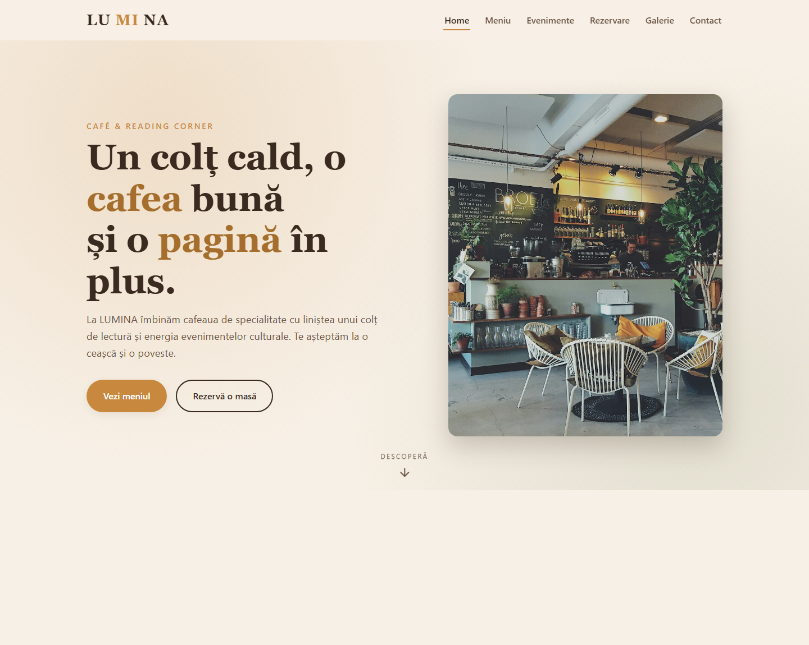
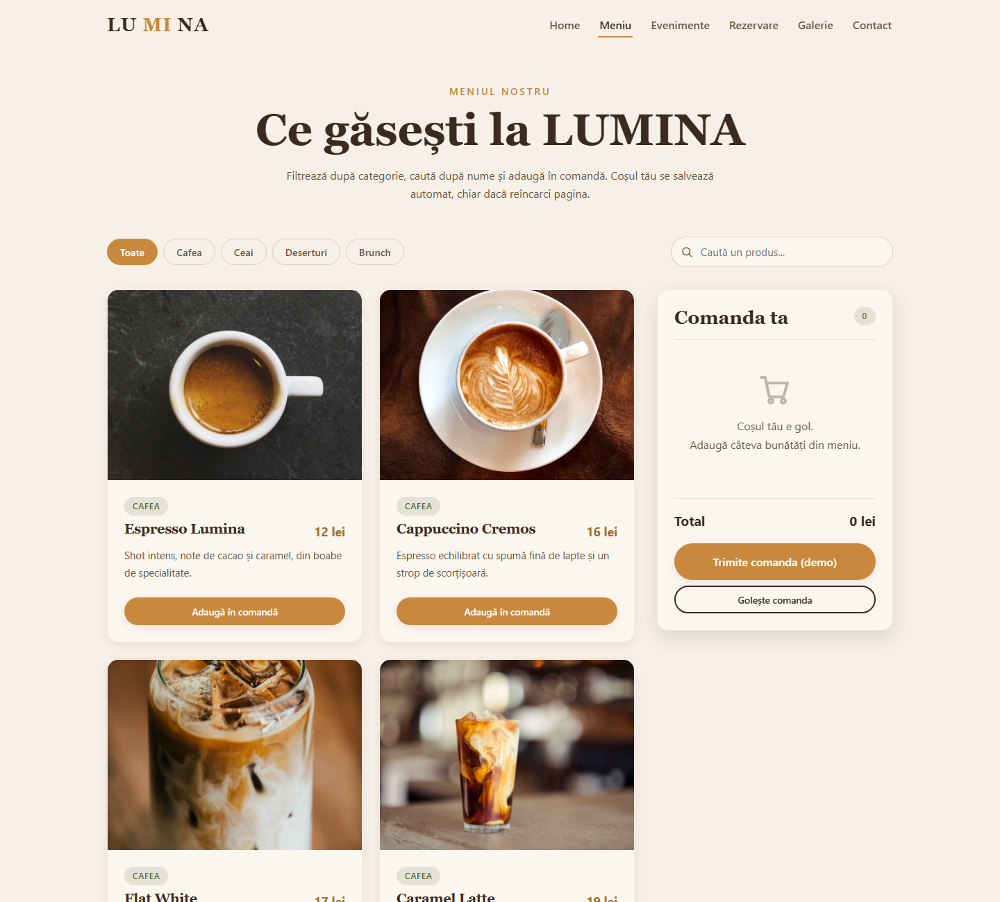
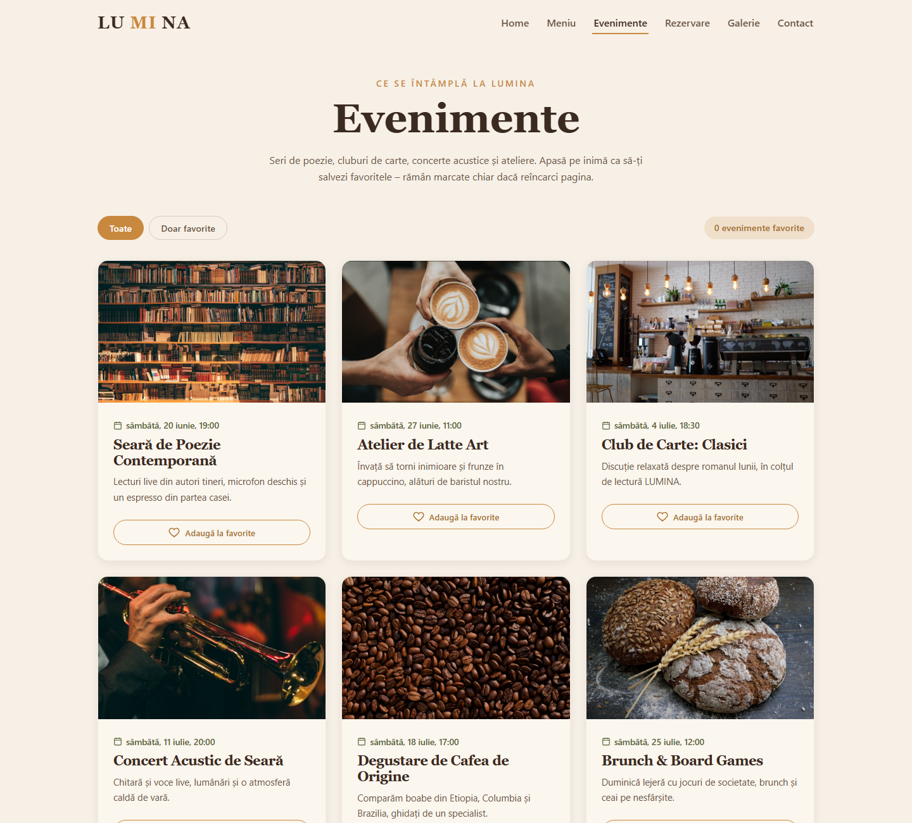
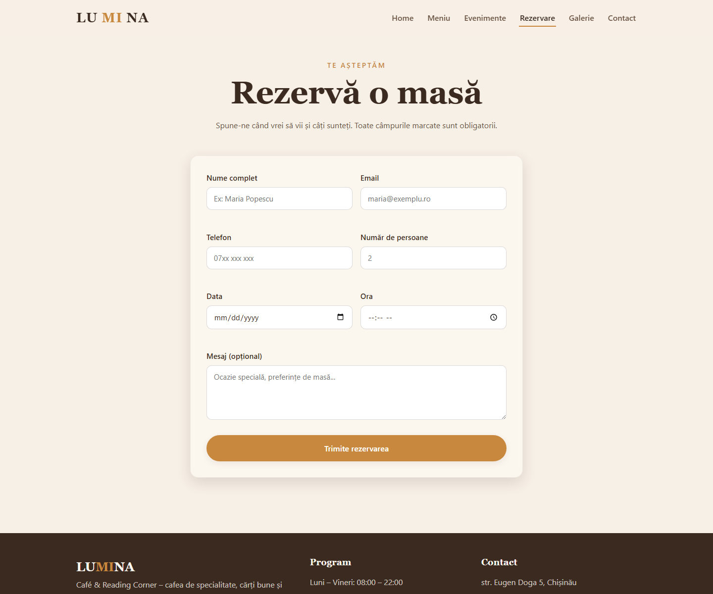
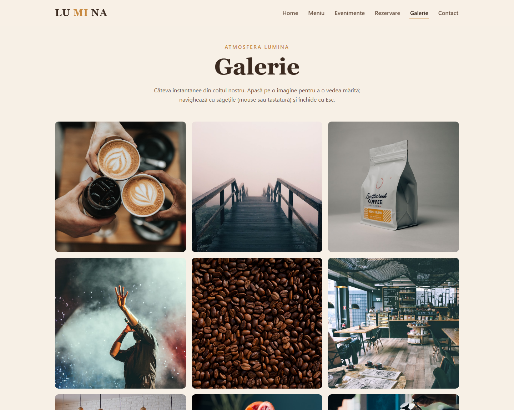
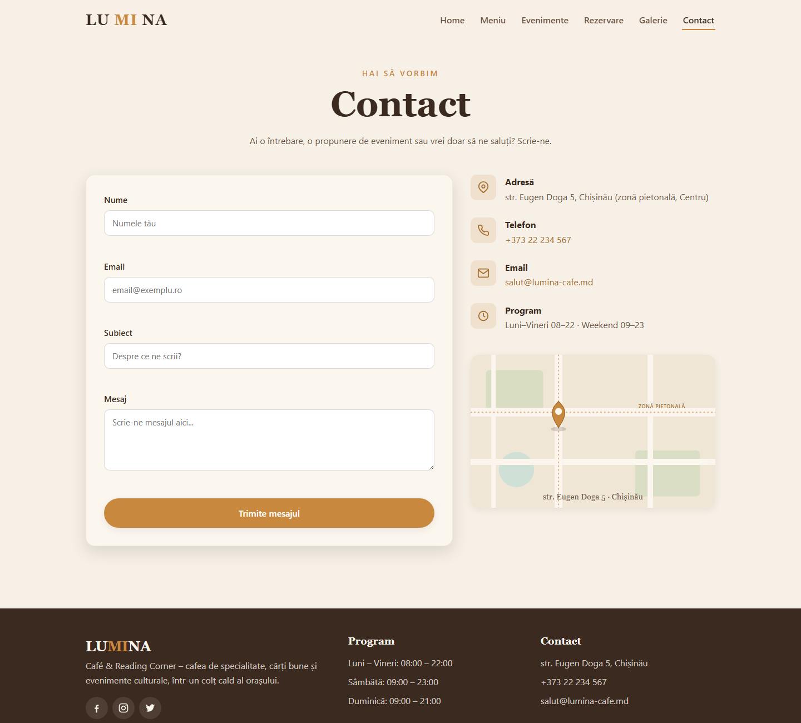
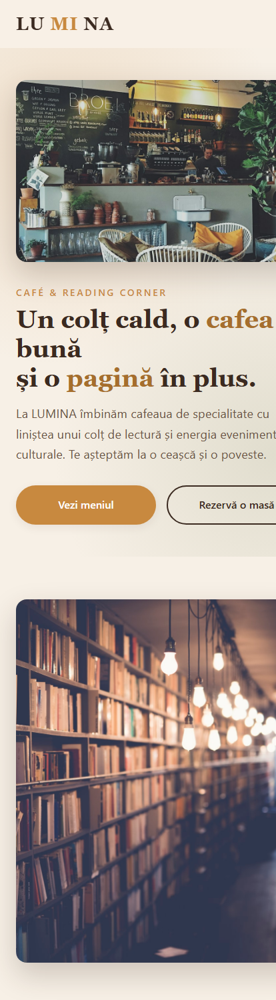

# RAPORT DE PRACTICĂ

### Aplicație web — LUMINA · Café & Reading Corner


**FACULTATEA DE MATEMATICĂ ȘI INFORMATICĂ**  

**Autor:** Nelly Prijilevschi  
**Grupa: ___________**  
**Specializare:** Anul I, Facultatea de Matematică și Informatică  
**Chișinău, 2026**  

**Demo online:** https://web-practica-one.vercel.app  
**Cod sursă:** https://github.com/AlbotCiprian/web_practica  

---

> *Cuprinsul este generat automat în varianta Word/PDF a raportului.*


---


## 1. Introducere și prezentarea scopului aplicației

Prezentul raport descrie proiectul de practică **LUMINA – Café & Reading Corner**, o aplicație web de prezentare pentru o cafenea boutique care îmbină trei concepte: cafeaua de specialitate, un colț de lectură și organizarea de evenimente culturale mici (seri de poezie, cluburi de carte, concerte acustice).

Scopul aplicației este dublu. Din perspectiva afacerii, site-ul oferă vizitatorilor o prezentare atractivă a locației, un meniu interactiv, o listă de evenimente și posibilitatea de a face o rezervare sau de a trimite un mesaj. Din perspectivă academică, proiectul demonstrează construirea unui site complet funcțional și responsive folosind **doar** tehnologiile web fundamentale, fără framework-uri, fără backend și fără bază de date.

Tema rezolvă o nevoie reală a unui mic business local: o prezență online curată, rapidă și ușor de folosit atât pe telefon, cât și pe desktop, cu câteva funcționalități interactive (comandă demonstrativă, favorite, formulare validate) care îmbunătățesc experiența utilizatorului, fără costuri de infrastructură.

Aplicația este publicată online și poate fi accesată la adresa: **https://web-practica-one.vercel.app**, iar codul sursă este disponibil public la: **https://github.com/AlbotCiprian/web_practica**.


## 2. Descrierea tehnologiilor utilizate

Proiectul folosește exclusiv tehnologii web standard, studiate în cadrul facultății, împreună cu instrumente moderne de versionare și publicare:

- **HTML5** — structura semantică a paginilor (header, main, section, article, footer, form).
- **CSS3** — designul vizual: variabile CSS (:root), Flexbox și CSS Grid pentru layout, animații și tranziții, media queries pentru un design 100% responsive (mobile-first).
- **JavaScript Vanilla (ES6+)** — toată interactivitatea: generarea navbar-ului și a footer-ului, filtrare și căutare, coșul de comandă, favoritele, validările formularelor și galeria cu lightbox.
- **localStorage** — salvarea datelor în browser (coș, favorite, rezervări), astfel încât acestea să persiste la reîncărcarea paginii, fără server și fără bază de date.
- **Git și GitHub** — versionarea codului și găzduirea publică a depozitului.
- **Vercel** — publicarea (deploy) site-ului static, cu auto-deploy la fiecare modificare din GitHub.

Nu au fost folosite biblioteci sau framework-uri externe (fără React, Vue, jQuery, Bootstrap sau Tailwind) și niciun CDN. Imaginile sunt fotografii reale cu licență liberă (Unsplash), descărcate local, astfel încât site-ul să nu depindă de niciun link extern.


## 3. Prezentarea structurii și funcționalităților site-ului


### 3.1. Organizarea fișierelor

Codul este organizat pe fișiere separate, după responsabilități (HTML pentru structură, CSS pentru stil, JavaScript pentru logică):

*Structura folderelor proiectului*

```
.
├── index.html            # Home
├── meniu.html            # Meniu interactiv (filtrare, căutare, coș)
├── evenimente.html       # Evenimente + favorite
├── rezervare.html        # Formular rezervare cu validări
├── galerie.html          # Galerie cu lightbox
├── contact.html          # Formular contact cu validări
├── css/
│   └── style.css         # Design system + componente + responsive
├── js/
│   ├── main.js           # Navbar, footer, helpers localStorage, animații
│   ├── data.js           # Datele: produse + evenimente
│   ├── meniu.js          # Filtrare, căutare, coș, total
│   ├── evenimente.js     # Render evenimente + favorite
│   ├── rezervare.js      # Validări formular rezervare
│   ├── contact.js        # Validări formular contact
│   └── galerie.js        # Lightbox
└── assets/images/        # Fotografii și grafică (logo, hartă)
```


### 3.2. Pagina Home (index.html)

Pagina de start cuprinde: o secțiune *hero* cu titlu, subtitlu și butoane de acțiune; secțiunea „Despre LUMINA”; trei carduri „De ce LUMINA”; o bandă de statistici cu numere animate (count-up); un preview cu trei produse populare (generate din datele aplicației) și un card cu următorul eveniment, calculat dinamic ca fiind cel mai apropiat eveniment viitor. Elementele apar treptat, cu un efect *fade-in* la derulare.


### 3.3. Pagina Meniu (meniu.html) — pagina centrală

- Produsele sunt încărcate din fișierul de date (13 produse în 4 categorii).
- **Filtrare pe categorii** (Cafea, Ceai, Deserturi, Brunch; „Toate” afișează tot).
- **Căutare live** după nume, fără diferență între majuscule și minuscule.
- Filtrarea și căutarea funcționează **combinat**.
- **Coș demo** cu cantități (+/−), ștergere produs și **total calculat automat** (preț × cantitate).
- **Persistență în localStorage**: coșul rămâne completat după reîncărcare; există butoane „Golește comanda” și „Trimite comanda (demo)”.
- Stări goale prietenoase (coș gol, căutare fără rezultate).


### 3.4. Pagina Evenimente (evenimente.html)

Afișează evenimentele sortate cronologic. Fiecare eveniment are un buton de tip *toggle* „Adaugă la favorite / ♥ Favorit”, iar favoritele se salvează în localStorage și rămân marcate după reîncărcare. Un filtru „Toate / Doar favorite” și un contor completează funcționalitatea.


### 3.5. Pagina Rezervare (rezervare.html)

Conține un formular cu câmpurile: nume, email, telefon, dată, oră, număr de persoane și un mesaj opțional. **Validările sunt realizate în JavaScript** (nu doar prin atributul HTML „required”): nume de minim 2 caractere, email valid (expresie regulată), telefon cu minim 10 cifre, dată care nu poate fi în trecut și număr de persoane între 1 și 12. Mesajele de eroare apar clar sub fiecare câmp, iar la trimiterea validă se afișează un mesaj de succes.


### 3.6. Pagina Galerie (galerie.html)

Un grid responsive de imagini și un **lightbox custom**, scris de la zero în JavaScript: click pe imagine deschide un overlay pe tot ecranul, cu navigare înainte/înapoi (săgeți și tastele ← →), închidere cu „X”, click pe fundal sau tasta Esc. Cât timp lightbox-ul este deschis, derularea paginii din spate este blocată.


### 3.7. Pagina Contact (contact.html)

Un formular de contact (nume, email, subiect, mesaj) cu validări în JavaScript (mesaj de minim 10 caractere) și o coloană cu informații utile: adresă (str. Eugen Doga 5, Chișinău — zonă pietonală), telefon, email, program și o hartă stilizată cu locația.


### 3.8. Componente comune și finisaje

- Navbar responsive, cu meniu „hamburger” animat pe mobil și link-ul paginii curente evidențiat.
- Footer identic pe toate paginile, cu anul curent generat dinamic și mențiunea autorului.
- Bară de progres la derulare, buton „înapoi sus” și animații *fade-in* în cascadă.
- Atenție la accesibilitate: contrast bun, texte alternative la imagini, focus vizibil, navigare cu tastatura pentru lightbox și meniul mobil.


---


## 4. Capturi de ecran

În continuare sunt prezentate capturile principalelor pagini ale aplicației, surprinse de pe varianta publicată online.


*Figura 1 — Pagina Home (secțiunea hero)*


*Figura 2 — Pagina Meniu, cu filtre, produse și coșul de comandă*


*Figura 3 — Pagina Evenimente, cu butoane de favorite*


*Figura 4 — Pagina Rezervare, cu formularul de rezervare*


*Figura 5 — Pagina Galerie*


*Figura 6 — Pagina Contact, cu informații și hartă*


*Figura 7 — Varianta pe mobil (design responsive)*


---


## 5. Explicații pentru fiecare captură de ecran

**Figura 1 — Home.** Captura arată secțiunea *hero*, cu mesajul principal și butoanele „Vezi meniul” și „Rezervă o masă”, alături de o fotografie reală a unui interior de cafenea. Cuvintele-cheie din titlu sunt evidențiate în culoarea de accent, iar în partea de jos apare un indicator animat de derulare. Mai jos (în afara cadrului) se găsesc secțiunile despre, cardurile de prezentare și banda de statistici cu numere animate.

**Figura 2 — Meniu.** Se observă butoanele de filtrare pe categorii, câmpul de căutare live și grila de produse cu fotografii reale. În dreapta este coșul de comandă, cu butoane +/− pentru cantitate și totalul calculat automat. Conținutul coșului se salvează în localStorage, deci rămâne completat și după reîncărcarea paginii.

**Figura 3 — Evenimente.** Fiecare eveniment este prezentat ca un card cu imagine, dată, descriere și un buton de favorite. Apăsarea butonului marchează evenimentul (inima se umple), iar starea se păstrează în localStorage. Contorul din partea de sus arată câte favorite sunt.

**Figura 4 — Rezervare.** Captura prezintă formularul de rezervare. La trimitere, fiecare câmp este verificat în JavaScript; câmpurile invalide sunt marcate vizual, iar mesajele de eroare apar sub ele. La completarea corectă se afișează un mesaj de confirmare.

**Figura 5 — Galerie.** Grila de imagini este afișată responsive. La click pe o imagine se deschide lightbox-ul pe tot ecranul, cu imaginea mărită, săgeți de navigare, o legendă și un contor „x / y”. Lightbox-ul poate fi controlat și de la tastatură.

**Figura 6 — Contact.** Captura arată formularul de contact alături de coloana cu informații (adresă în zona pietonală din centrul Chișinăului, telefon, email, program) și o hartă stilizată cu un marcaj de locație. Și aici validările sunt realizate în JavaScript.

**Figura 7 — Mobil.** Ilustrează comportamentul responsive: navbar-ul devine meniu „hamburger”, iar conținutul se rearanjează pe o singură coloană, fără derulare orizontală, rămânând lizibil și pe ecrane mici.


---


## 6. Concluzii

Proiectul LUMINA demonstrează că se poate construi un site modern, atractiv și complet funcțional folosind exclusiv tehnologiile web de bază, fără framework-uri și fără backend. Aplicația rulează prin simpla deschidere a fișierelor și a putut fi publicată gratuit pe o platformă de găzduire statică.


### Ce am învățat (competențe dezvoltate)

- Structurarea semantică și accesibilă a paginilor în HTML5.
- Crearea unui *design system* consecvent în CSS3 (variabile, Grid, Flexbox, animații) și implementarea unui layout complet responsive, mobile-first.
- Programarea interactivității în JavaScript Vanilla: manipularea DOM-ului, evenimente, filtrare/căutare, lucrul cu array-uri și obiecte.
- Folosirea localStorage pentru persistarea datelor fără backend.
- Implementarea validărilor de formulare și a unei componente complexe (lightbox) de la zero.
- Organizarea codului pe fișiere, eliminarea duplicării prin funcții comune și comentarea clară a logicii.
- Versionarea cu Git/GitHub și publicarea unui site prin Vercel, cu auto-deploy.

Rezultatul final este o aplicație web coerentă, ușor de explicat și de extins, care reflectă cunoștințele acumulate în primul an de studiu.


---


## 7. Anexă — fragmente relevante din codul sursă

Mai jos sunt prezentate fragmentele cele mai importante din cod, comentate, organizate pe teme. Codul complet se găsește în depozitul proiectului.


### 7.1. Helpers pentru localStorage (js/main.js)

Centralizează citirea/scrierea în localStorage, cu transformare automată în/din JSON. Sunt refolosite de toate paginile, ca să nu existe cod duplicat.

```
// Citește o valoare din localStorage și o transformă din JSON.
function citesteStocare(cheie, implicit) {
  try {
    const brut = localStorage.getItem(cheie);
    return brut ? JSON.parse(brut) : implicit;
  } catch (e) {
    return implicit;
  }
}
// Scrie o valoare în localStorage (o serializează în JSON).
function scrieStocare(cheie, valoare) {
  localStorage.setItem(cheie, JSON.stringify(valoare));
}
```


### 7.2. Filtrare + căutare combinate (js/meniu.js)

Filtrează produsele simultan după categoria selectată și după textul căutat.

```
function produseFiltrate() {
  return PRODUSE.filter(function (p) {
    // Categoria: „Toate” trece tot
    const okCategorie = categorieActiva === 'Toate' || p.categorie === categorieActiva;
    // Căutarea: numele conține textul (case-insensitive)
    const okCautare = p.nume.toLowerCase().indexOf(textCautare.toLowerCase()) !== -1;
    return okCategorie && okCautare;
  });
}
```


### 7.3. Calculul automat al totalului din coș (js/meniu.js)

Parcurge produsele din coș, înmulțește prețul cu cantitatea și adună totul.

```
let total = 0;
idsuri.forEach(function (idStr) {
  const produs = gasesteProdus(parseInt(idStr, 10));
  const cant = cos[idStr];
  total += produs.pret * cant; // preț × cantitate
});
elCosTotal.textContent = total + ' lei';
```


### 7.4. Favorite salvate în localStorage (js/evenimente.js)

Adaugă sau scoate un eveniment din favorite (toggle) și salvează imediat starea.

```
function comutaFavorit(id) {
  if (esteFavorit(id)) {
    favorite = favorite.filter(function (x) { return x !== id; });
  } else {
    favorite.push(id);
  }
  scrieStocare(CHEIE_FAV, favorite); // salvăm imediat
  randeaza();
}
```


### 7.5. Validarea formularului de rezervare (js/rezervare.js)

Validări în JavaScript, cu mesaje de eroare clare. Exemple: email cu expresie regulată și dată care nu poate fi în trecut.

```
// Email – format valid
const regexEmail = /^[^\s@]+@[^\s@]+\.[^\s@]+$/;
if (!regexEmail.test(email)) {
  seteazaEroare('email', 'err-email', 'Introdu o adresă de email validă.');
  valid = false;
}
// Data – să nu fie în trecut
const aleasa = new Date(data);
const azi = new Date(); azi.setHours(0, 0, 0, 0);
if (aleasa < azi) {
  seteazaEroare('data', 'err-data', 'Data nu poate fi în trecut.');
  valid = false;
}
```


### 7.6. Lightbox cu navigare ciclică (js/galerie.js)

Operatorul modulo (%) face navigarea să „treacă” de la ultima imagine la prima și invers.

```
function imagineUrmatoare() {
  indexCurent = (indexCurent + 1) % IMAGINI.length;
  actualizeazaImagine();
}
// Navigare cu tastatura, doar când lightbox-ul e deschis
document.addEventListener('keydown', function (e) {
  if (!lightbox.classList.contains('deschis')) return;
  if (e.key === 'Escape') inchideLightbox();
  else if (e.key === 'ArrowRight') imagineUrmatoare();
  else if (e.key === 'ArrowLeft') imagineAnterioara();
});
```


### 7.7. Animație fade-in la derulare (js/main.js)

Folosește IntersectionObserver pentru a anima elementele când intră în ecran.

```
const observator = new IntersectionObserver(function (intrari) {
  intrari.forEach(function (intrare) {
    if (intrare.isIntersecting) {
      intrare.target.classList.add('vizibil');
      observator.unobserve(intrare.target); // animăm o singură dată
    }
  });
}, { threshold: 0.12 });
```


### 7.8. Variabile de design în CSS (css/style.css)

Paleta și spacing-ul sunt definite o singură dată în :root și refolosite peste tot.

```
:root {
  --crem: #F7F0E6;
  --caramel: #C8893F;
  --maro: #3B2A20;
  --masliniu: #6B7A4F;
  --sp-3: 24px;
  --radius: 16px;
  --tranzitie: 250ms ease;
}
```
